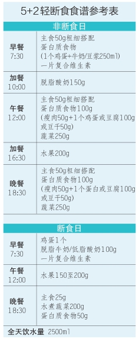
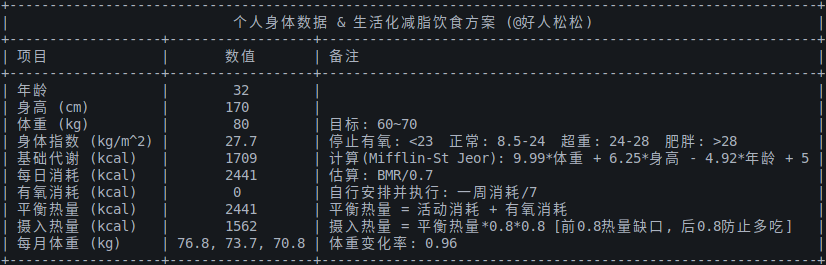

# “野蛮其体魄”

## 5+2 轻断食食谱参考

## 生活化减脂饮食方案

## 食谱数据采集生成步骤

**当前captures目录下的标注数据是经过人工手动调整的，所以最好在执行自动处理程序前将其备份**

| 步骤 | 脚本 | 状态 | 输出文件 | 备注 |
|------|--------|--------|-------|---------|
| 1 | detect_recipe_thumbnail.py | Done | captures/*.json | detect coarse bbox using cv2.findContours |
| 2 | [Manual] | Done | captures/*.json | adjust using labelme |
| 3 | adjust_with_xywh_stats.py | Done | captures/recipe_thumbnails.csv | adjust according to xywh stats |
| 4 | recognize_recipe_name.py | Done | recipes_crop_recog/*.png(json) | using paddleocr |
| 5 | resize_and_extract.py | Half-Done | recipes/recipe.csv | [cook/app/data/recipe.csv](https://github.com/YunYouJun/cook/blob/dev/app/data/recipe.csv?plain=1)

## 致谢

- https://github.com/YunYouJun/cook
- https://github.com/Anduin2017/HowToCook
- https://space.bilibili.com/2078781964
